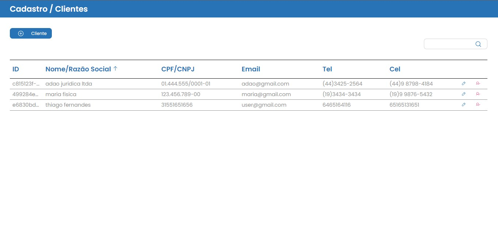
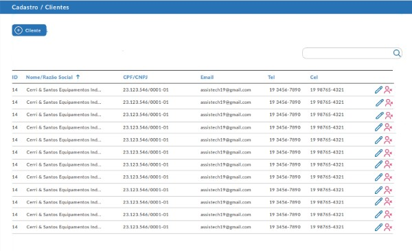
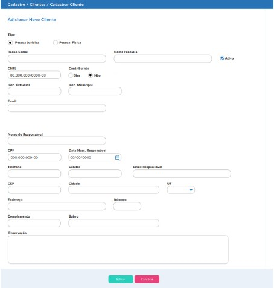
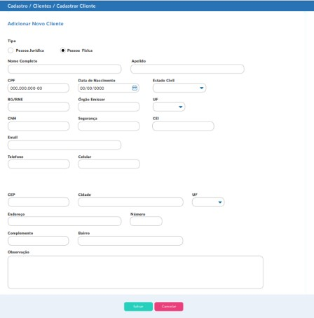

<h1 align="center">

  

</h1>

# Teste prático realizado para vaga de desenvolvedor frontend na Intesis


## Índice
<br />

- <a href="#-sobre-o-projeto">Sobre</a>
- <a href="#-especificacoes">Especificações</a> 
- <a href="#-layout">Layout</a>
- <a href="#-como-executar-o-projeto">Como executar o projeto localmente</a>
- <a href="#-tecnologias">Tecnologias</a> 
- <a href="#-autor">Autor</a>
---

## 💻 Sobre o teste

📍 Foi encaminhada a diretriz do teste com as especificações e requisitos que precisavam ser comtemplados no teste.

---

## ⚙ Especificações

📍 Desenvolver um CRUD com as seguintes características: 

🔎 Consulta e Cadastro de cliente;<br/>

🤖 Tecnologias: HTML/CSS, Javascript, ReactJS.<br/>

🤖 Utilizar API/REST Mock para simular o backend da aplicação, como por exemplo, JSON Server.<br/>

👉 A consulta deve listar os registros cadastrados e filtrá-los por Nome/Razão Social, além de permitir a inclusão, edição e exclusão.

👉 O cadastro deve conter os seguintes campos:


- [x] Check Ativo/Inativo
- [x] Tipo Pessoa (Física = F / Jurídica = J) - por padrão J
- [x] Nome / Nome Fantasia (campo obrigatório)
- [x] Razão Social (campo obrigatório se pessoa J)
- [x] CPF / CNPJ (campo obrigatório) (Se o Cliente for pessoa física, trazer e validar estrutura do campo para CPF; se o Cliente for pessoa jurídica, trazer e validar estrutura do campo para CNPJ).
- [x] R.G. (Registro Geral somente para cliente tipo F) / RNE (Registro Nacional de Estrangeiro somente para cliente tipo F) / I.E. (Inscrição estadual somente para cliente tipo J)
- [x] Órgão Emissor + UF (do campo RG / RNE e somente para cliente tipo F)
- [x] I.M. (Inscrição municipal somente para cliente tipo J)
- [x] CNH + Código Segurança (F)
- [x] Data Nascimento (somente para Tipo F)
- [x] E-mail (campo obrigatório)
- [x] Telefone (+ DDD)
- [x] Celular (+ DDD)
- [x] Nome Responsável (J)
- [x] CPF Responsável (J)
- [x] Data Nascimento Responsável (J)
- [x] E-mail Responsável (J)
- [x] Telefone Responsável (J) (+ DDD)
- [x] Celular Responsável (J) (+ DDD)
- [x] CEP (campo obrigatório)
- [x] Tipo Logradouro (campo obrigatório)
- [x] Logradouro (campo obrigatório)
- [x] Número (campo obrigatório)
- [x] Complemento
- [x] Bairro (campo obrigatório)
- [x] Cidade (campo obrigatório)
- [x] UF (campo obrigatório)
- [x] Observação

Exemplo de implementação da interface gráfica:

<p align="center">

  

  

  

</p>

[Veja as especificações no original clicando aqui!](https://docs.google.com/document/d/1SFPLz5W8Rhp7Sz1CqGbjr2NTDllk5W2CfbCMPlpuTbY/edit)

- [x] O prazo de entrega foi de 48 horas, e o projeto FOI ENTREGUE no prazo.

- [x] TODAS as características foram implementadas: 

- - [x] Filtro por nome e/ou razão Social
- - [x] Listagem de Clientes
- - [x] Possibilidade de Adicionar novo cadastro, alterar ou excluir
- - [x] Possibilidade de incluir cadastro, editar ou excluir
- - [x] O conceito de API REST foi implementado utilizando Json-Server 
- - [x] O conceito de API REST foi implementado utilizando Json-Server 
- - [x] O projeto foi desenvolvido com [ReactJs](https://react.dev/) e [Typescript](https://www.typescriptlang.org/) .

---

## 🎨 Layout 

Como ficou o layout da aplicação:


---

## 📱 Mobile

Por não haver especificação e por causa do prazo, optei por não desenvolver as telas de forma responsiva.

### 💻 Web

<p align="center">

  A tela inicial recebe os dados consumidos do back-end fake, os dados são exibidos na tabela, cada usuario exibido pode receber alteração ou edição em seu proprio cadastro. <br />
  O filtro também pode ser observado em funcionamento buscando pelo "nome":
  

  É possível excluir um item, e a tabela apresenta os dados sem o dado excluido:
  

  Ao clicar em adicionar novo cadastro, o usuário tem a possibilidade de cadastrar um usuário do tipo pessoa física ou jurídica, com diferentes campos nos respectivos formularios:
  

  Foi realizada a validação de todos os dados de ambos os campos, não sendo possível enviar dados incompatíveis com o campo ou enviar o formulário em branco, como no exemplo, podendo o usuário cancelar sua ação e retornar na página de tabela:
  

  Um novo usuário pode ser adicionado:
  

  O usuário pode ter seus dados alterados:
  

  
</p>

---

## 🚀 Como executar o projeto

Este projeto possui o Frontend e um Backend fake:

Antes de começar, você vai precisar ter instalado em sua máquina as seguintes ferramentas:

- [Git](https://git-scm.com)<br />
- [Node.js](https://nodejs.org/en/)

Além disto, é bom ter um editor de código para trabalhar com o código como o [VSCode](https://code.visualstudio.com/) .

#### 🎲 Rodando o Frontend 

```bash

#Clone o repositório: 
$ git colne git@github.com:thiago-mfernandes/Teste-Pratico-Intesis.git

#Acesse a pasta do projeto pelo terminal/cmd
$ cd Teste-Pratico-Intesis

#Acesse a subpasta
$ cd intesis

#Instale as dependências do projeto
$ npm install

#Execute o servidor local para que a API REST FAKE sirva o frontend com os dados
$ npm run server

#Execute a aplicação em modo de desenvolvimento
$ npm run dev

# O servidor inciará na porta:3000 - acesse http://localhost:3000

```
---

## 🛠 Tecnologias

As seguintes ferramentas foram usadas na construção do projeto:

#### **Website**  

- **[ReactJs](https://pt-br.reactjs.org/)**

- **[Typescript](https://www.typescriptlang.org/)**

- **[React Router](https://reactrouter.com/en/main)**

- **[Axios](https://axios-http.com/ptbr/docs/intro)**

- **[Styled-Components](https://styled-components.com/)**

- **[React Hook Form](https://react-hook-form.com/)**

- **[JSON Server](https://github.com/typicode/json-server)**


#### **Utilitários**

- **[Phosphor Icons](https://phosphoricons.com/)**

- **[UUID V4](https://www.npmjs.com/package/uuidv4)**

- **[React Input Mask](https://github.com/sanniassin/react-input-mask)**


> Veja o arquivo [package.json](https://github.com/thiago-mfernandes/Teste-Pratico-Intesis/blob/main/intesis/package.json)

---

## 🦸 Autor


 
 <br />
 <sub>
  <b>Thiago Fernandes 🚀</b>
 </sub>
 

 
[](https://www.linkedin.com/in/thiago-mello-fernandes-frontend-react-js-javascript/)
---

## 📝 Licença

Feito com ❤️ por Thiago Fernandes 👋🏽 [Entre em contato!](https://whatsa.me/5519984009105)

---
